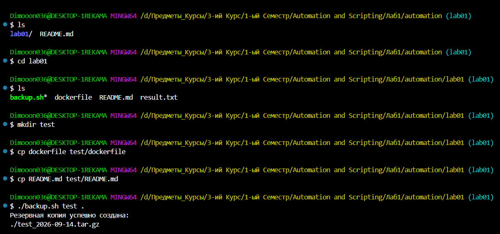

# Лабораторная работа 1 по Automation and Scripting

## Задача 1

Автоматизируй задачу с помощью скрипта Shell:

### Создание резервной копии важной директории

- Скрипт следует назвать  backup.sh;
- Скрипт должен принимать два аргумента: путь к каталогу для резервного копирования и путь к каталогу для сохранения резервной копии;
- Второй аргумент должен быть необязательным и по умолчанию указывать на каталог  /backup;
- Скрипт должен создать  tar.gz архив, в имени файла которого будет указана текущая дата;
- Скрипт должен проверить существование указанных каталогов и вывести соответствующие сообщения об ошибках.

### Выполнение

#### Код файла backup.sh

Этот файл и будет принимать 2 аргумента, указывать на нужный каталог, создавать архив и проверять каталоги.

```#!/bin/bash

# Проверяем количество аргументов
if [ "$#" -lt 1 ] || [ "$#" -gt 2 ]; then
    echo "Ошибка: необходимо указать путь к каталогу для резервного копирования."
    echo "Использование: $0 <каталог_для_копирования> [каталог_для_архива]"
    exit 1
fi

# Первый аргумент — каталог для резервного копирования
SOURCE_DIR="$1"

# Второй аргумент — каталог для сохранения архива.
# Если он не указан, используется /backup
BACKUP_DIR="${2:-/backup}"

# Проверяем существование исходного каталога
if [ ! -d "$SOURCE_DIR" ]; then
    echo "Ошибка: каталог для резервного копирования не существует: $SOURCE_DIR"
    exit 1
fi

# Проверяем существование каталога для резервной копии
if [ ! -d "$BACKUP_DIR" ]; then
    echo "Ошибка: каталог для сохранения резервной копии не существует: $BACKUP_DIR"
    exit 1
fi

# Получаем текущую дату
DATE=$(date +"%Y-%m-%d")

# Получаем имя исходного каталога
DIR_NAME=$(basename "$SOURCE_DIR")

# Формируем имя архива
ARCHIVE="$BACKUP_DIR/${DIR_NAME}_${DATE}.tar.gz"

# Создаём архив
tar -czf "$ARCHIVE" -C "$(dirname "$SOURCE_DIR")" "$DIR_NAME"

# Проверяем результат
if [ $? -eq 0 ]; then
    echo "Резервная копия успешно создана:"
    echo "$ARCHIVE"
else
    echo "Ошибка: не удалось создать резервную копию."
    exit 1
fi
```

#### Запуск файла backup.sh

1. Открываем VSCode в папке с этим файлом
2. Открываем Терминал и снизу-справо рядом с плюсом нажимаем на стрелку и открываем "Git Bash"

3. Пишем команды как на скриншоте 2

4. Готово, мы удостоверились что код работает и выполнили все требоватия к Лаб. раб. 1!
